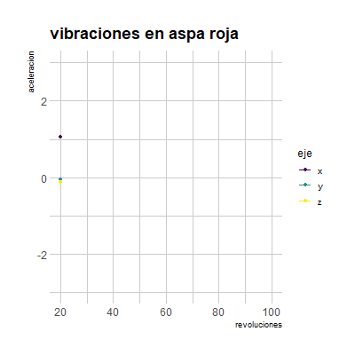

Presentacion EDA Datos acelerometro de 3 dimensiones en aspa de motor
========================================================
author: Javier Saavedra
date: 9/29/2022
autosize: true

Contexto
========================================================
La base de datos consiste en valores recopilados a traves de un acelerometro montado en un aspa propulsada por un motor. respecto al aspa tenemos 3 variantes, las cuales se diferencian por pesos dispuestos de maneras distintas para generar 3 escenarios de vibraciones distintas para analizar, estos datos transcurren dependiendo de las revoluciones de giro del motor( RPM).

- Rojo: Configuración normal dos piezas de peso colocadas en palas vecinas
- Azul: Configuración perpendicular dos piezas de peso colocadas sobre palas que forman un ángulo de 90 grados
- Verde: Configuración opuesta dos piezas de peso colocadas en palas opuestas

¿Que mide un acelerometro?

¿y los datos?
========================================================

¿y los datos?
========================================================

¿y los datos?
========================================================

¿Como se comportan?
========================================================

¿Como se comportan?
========================================================

¿Como se comportan?
========================================================

